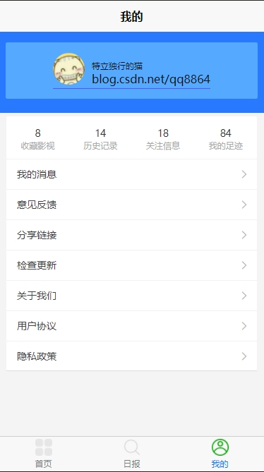
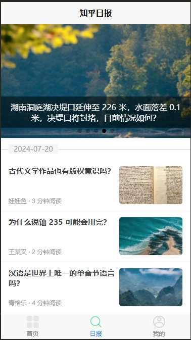
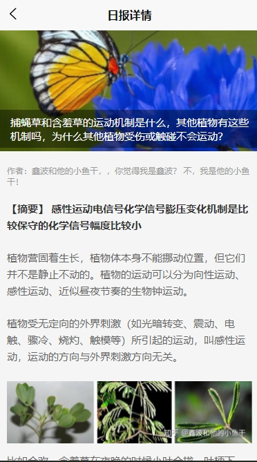

# imovie 影视类小程序完整项目模板
> 爱影家，影视类小程序
> 一个5年的web前端开源的uni-app快速开发模板，参考学习一同进步, 影视类小程序项目
> 建议uni-app使用时间达到1年以上的程序员来学习
> 项目实现博文介绍:(https://blog.csdn.net/qq8864/article/details/122154385) uniapp小程序开发 | 从零实现一款影视类app 

### 项目介绍
- 项目基于uni-app开发，使用vue.js开发，使用scss/sass编写样式，使用uni-app插件，实现了完整的电影类小程序功能，包括首页、电影详情、电影搜索、电影分类、电影评价、电影收藏、个人中心、电影评分、电影评论、头部导航、知乎日报列表、知乎日报详情、滑动操作、表单提交等功能。
- 项目使用uni-app开发，可以直接在HBuilder X里面运行，也可以打包成H5、Android、IOS等平台。
- 项目使用vue.js开发，熟悉vue.js开发，可以快速上手，学习vue.js开发。

### 使用步骤
1. 下载下来，解压成文件夹
2. 把项目包丢到HBuilder X里面
3. HBuilder X要安装scss/sass编译插件
4. 运行项目
5. 体验完整的电影类小程序功能

### 项目截图








### `觉得不错，给个5星好评吧`

| `QQ交流群(92381027)`         | `微信交流群（加我q:534117529,wx:yongzhen1111,备注"进群"）`                  |
| ----------------------------|--------------------------- |
|||
| QQ群号：92381027 |微信号：yongzhen1111|

### `开源不易，需要花费很多精力，打个赏吧`
| `微信打赏码`         | `支付宝打赏码`                  |
| ----------------------------|--------------------------- |
|

### 常见问题
1.如何运行？

答：默认地址连的我的测试服务器，可直接运行。或者联系我部署自己的golang后台服务，或者实现你自己的接口。


### [H5预览地址](https://blog.csdn.net/qq8864)
### [安卓APP安装包下载地址（最新版）](https://blog.csdn.net/qq8864)
### [Demo版GitHub地址](https://blog.csdn.net/qq8864)
---

## 架构功能清单
### 组件示例
1. 轮播图
2. 横向滚动列表
2. 电影详情页   
3. 电影搜索页
4. 电影分类页
5. 电影评价页
6. 电影收藏页
7. 个人中心页
8. 电影评分
9. 电影评论
10. 头部导航示例
11. 上拉加载，下拉刷新列表
12. 知乎日报列表页
13. 知乎日报详情页
14. 滑动操作
15. 表单提交页

### 后台接口
1. 轮播图接口
2. 电影列表接口
3. 电影详情接口
4. 电影搜索接口
5. 电影分类接口
6. 电影评价接口
7. 电影收藏接口
8. 个人中心接口
9. 电影评分接口
10. 电影评论接口
11. 头部导航接口
12. 知乎日报列表接口
13. 知乎日报详情接口
14. 滑动操作接口
15. 表单提交接口

### 模板页面
1. 首页
2. 电影详情页
3. 电影搜索页
4. 电影分类页
5. 电影评价页
6. 电影收藏页
7. 个人中心页
8. 电影评分
9. 电影评论
10. 头部导航示例
11. 知乎日报列表页
12. 知乎日报详情页
13. 滑动操作
14. 表单提交页

### 项目结构

``` bash
├─api                                          // 后台接口
├─common                                       // 公共组件
├─components                                   // 业务组件
├─doc                                          // 项目文档
├─mock                                         // mock数据
│  └─better-mock
├─pages                                          // 页面
│  ├─about                                       // 关于页面
│  └─tabBar                                      // 底部导航
│      ├─index                                   // 首页
│      │  ├─detail                               // 电影详情页
│      │  ├─moreMovie                            // 电影详情
│      │  └─search                               // 电影搜索
│      ├─list
│      │  └─detail                               // 电影列表
│      └─mine
│          ├─report                              // 用户反馈
│          ├─xieyi                               // 用户协议
│          └─yinsi                               // 隐私协议
├─static                                         // 静态资源
│  ├─hot
│  ├─swiper
│  └─tabbar
├─uni_modules                                  // uni-app插件
│  ├─uni-badge
│  │  └─components
│  │      └─uni-badge
│  └─uni-ui
│      └─components
│          └─uni-ui
└─utils                                         // 工具类
```

### 使用到的一些后台api接口

- 轮播图接口：https://api.imovie.vip/api/v1/banner
- 电影列表接口：https://api.imovie.vip/api/v1/movie/list
- 电影详情接口：https://api.imovie.vip/api/v1/movie/detail
- 电影搜索接口：https://api.imovie.vip/api/v1/movie/search      
- 电影分类接口：https://api.imovie.vip/api/v1/movie/category
- 电影评价接口：https://api.imovie.vip/api/v1/movie/comment
- 电影收藏接口：https://api.imovie.vip/api/v1/movie/collect
- 个人中心接口：https://api.imovie.vip/api/v1/user/info
- 电影评分接口：https://api.imovie.vip/api/v1/movie/score
- 电影评论接口：https://api.imovie.vip/api/v1/movie/comment
- 头部导航接口：https://api.imovie.vip/api/v1/nav
- 知乎日报列表接口：https://api.imovie.vip/api/v1/zhihudaily/list
- 知乎日报详情接口：https://api.imovie.vip/api/v1/zhihudaily/detail
- 滑动操作接口：https://api.imovie.vip/api/v1/slide
- 表单提交接口：https://api.imovie.vip/api/v1/report

### https://github.com/shichunlei/-Api/blob/master/%E8%B1%86%E7%93%A3%E7%94%B5%E5%BD%B1.md#new_movies
get https://news-at.zhihu.com/api/4/news/latest

###历史日报
get https://news-at.zhihu.com/api/4/news/before/20240617

### 热门日报
get http://news-at.zhihu.com/api/4/news/hot

### 主题日报
get http://news-at.zhihu.com/api/4/news/theme/2024
### 2016年
get http://news-at.zhihu.com/api/4/news/before/20240721

### 日报详情
get http://news-at.zhihu.com/api/4/news/9773253

### 2017年
### 2015年
### Below is the code of e:\test\vue\imovie\doc\douban.http
### Swiper request /api/v1/swiperdata
get http://175.178.126.10:8000/api/v1/swiperdata

### 知乎日报
get http://175.178.126.10:8000/api/v1/zhihunews/20240720

### 知乎日报 详情
get http://175.178.126.10:8000/api/v1/zhihudetail/9773231

### Hot movie request /api/v1/hotmovie
### 即将上映影视
post https://api.douban.com/v2/movie/coming_soon
Content-Type:application/json

{
    "start": 40,
    "count": 10,
    "city": "郑州",
    "apikey": "0ab215a8b1977939201640fa14c66bab"
}

### 即将上映
post http://175.178.126.10:8000/api/v1/soonmovie
Content-Type:application/json
 
{
    "start": 0,
    "count": 1
}

### 最新上映
post http://175.178.126.10:8000/api/v1/newmovie
Content-Type:application/json
 
{
    "start": 0,
    "count": 1
}
### 正在热映
post http://175.178.126.10:8000/api/v1/hotmovie
Content-Type:application/json
 
{
    "start": 36,
    "count": 12,
    "city": "郑州"
}
### 周榜
post http://175.178.126.10:8000/api/v1/weekmovie
Content-Type:application/json
 
{
    "start": 0,
    "count": 1
}

### 北美票房榜
post http://175.178.126.10:8000/api/v1/usmovie
Content-Type:application/json
 
{
    "start": 0,
    "count": 1
}

### 电影详情
post http://175.178.126.10:8000/api/v1/detailmovie
Content-Type:application/json
 
{
    "id": "36877322"
}

### top250 movie request /api/v1/topmovie
post http://175.178.126.10:8000/api/v1/topmovie
Content-Type:application/json
 
{
    "start": 0,
    "count": 2
}

### 电影搜索
post http://175.178.126.10:8000/api/v1/searchmovie
Content-Type:application/json
 
{
    "q": "肖申克的救赎",
    "start": 0,
    "count": 1
}

### Below is the code of douban.http,use vscode extension REST Client to send request.
###正在热映影视
post https://api.douban.com/v2/movie/in_theaters
Content-Type:application/json
 
{
    "start": 0,
    "count": 1,
    "city": "郑州",
    "apikey": "0ab215a8b1977939201640fa14c66bab"
}

### Top250 movie request /api/v1/top250movie
### 豆瓣电影Top250
post https://api.douban.com/v2/movie/top250 
Content-Type:application/json
 
{
    "start": 0,
    "count": 2,
    "city": "郑州",
    "apikey": "0df993c66c0c636e29ecbb5344252a4a"
}

### new movie request /api/v1/newmovie  

### 最新上映影视 
### 0df993c66c0c636e29ecbb5344252a4a 能用
post https://api.douban.com/v2/movie/new_movies
Content-Type:application/json
 
{
    "apikey": "0df993c66c0c636e29ecbb5344252a4a"
}

### 北美票房榜
post https://api.douban.com/v2/movie/us_box
Content-Type:application/json
 
{
    "apikey": "0df993c66c0c636e29ecbb5344252a4a"
}


### search movie request /api/v1/searchmovie
### 搜索电影
post https://api.douban.com/v2/movie/search
Content-Type:application/json
 
{
    "q": "肖申克的救赎",
    "start": 0,
    "count": 1,
    "apikey": "0ab215a8b1977939201640fa14c66bab"
}

### movie detail request /api/v1/moviedetail
### 电影详情
post https://api.douban.com/v2/movie/subject/36877322
Content-Type:application/json
 
{
    "apikey": "0ab215a8b1977939201640fa14c66bab"
}   

### movie comments request /api/v1/moviecomments
### 电影评论 短评 "msg": "need_permission", "code": 1000,
### 0df993c66c0c636e29ecbb5344252a4a 能用
post https://api.douban.com/v2/movie/subject/1292052/comments
Content-Type:application/json
 
{
    "start": 0,
    "count": 1,
    "apikey": "0df993c66c0c636e29ecbb5344252a4a"
}

### weekly movie request /api/v1/weeklymovie    
### 电影本周口碑榜 0df993c66c0c636e29ecbb5344252a4a 能用
post https://api.douban.com/v2/movie/weekly
Content-Type:application/json
 
{
    "apikey": "0df993c66c0c636e29ecbb5344252a4a"
}

### 电影条目剧照
post https://api.douban.com/v2/movie/subject/1292052/photos
Content-Type:application/json
 
{
    "apikey": "0df993c66c0c636e29ecbb5344252a4a"
}

### celebrity movie request /api/v1/celebritymovie
### 影人剧照 ----不能用
post https://api.douban.com/v2/movie/celebrity/1044707/photos
Content-Type:application/json
 
{
    "start": 0,
    "count": 1,
    "apikey": "0df993c66c0c636e29ecbb5344252a4a"
}

### 电影 影评
### 0df993c66c0c636e29ecbb5344252a4a 能用
post https://api.douban.com/v2/movie/subject/1292052/reviews
Content-Type:application/json
 
{
    "start": 0,
    "count": 1,
    "apikey": "0df993c66c0c636e29ecbb5344252a4a"
}

### 豆瓣音乐
### 不能用 0df993c66c0c636e29ecbb5344252a4a "msg": "apikey is required","code": 131,
post https://api.douban.com/v2/music/search
Content-Type:application/json
 
{
    "q": "周杰伦",
    "start": 0,
    "count": 1,
    "apikey": "0df993c66c0c636e29ecbb5344252a4a"
}

###GET  https://api.douban.com/v2/music/:id
### 豆瓣音乐详情
### 不能用 0df993c66c0c636e29ecbb5344252a4a  "msg": "invalid_credencial2","code": 109,
get https://api.douban.com/v2/music/104727?apikey=0df993c66c0c636e29ecbb5344252a4a
Content-Type:application/json
 
{
    "apikey": "0df993c66c0c636e29ecbb5344252a4a"
}

### 豆瓣图书详情
### 0df993c66c0c636e29ecbb5344252a4a 能用
post https://api.douban.com/v2/book/2129650
Content-Type:application/json
 
{
    "apikey": "0df993c66c0c636e29ecbb5344252a4a"
}

### 豆瓣图书 评论
### 0df993c66c0c636e29ecbb5344252a4a 能用
post https://api.douban.com/v2/book/2129650/comments
Content-Type:application/json
 
{   
    "start": 0, 
    "count": 1,                     
    "apikey": "0df993c66c0c636e29ecbb5344252a4a"
}

### 豆瓣图书
### 0df993c66c0c636e29ecbb5344252a4a 能用
post https://api.douban.com/v2/book/search
Content-Type:application/json
 
{
    "q": "西游记",
    "start": 0,
    "count": 1,
    "apikey": "0df993c66c0c636e29ecbb5344252a4a"
}

### 豆瓣图书 热门
### 不可用 "msg": "invalid_credencial2","code": 109,
get https://api.douban.com/v2/book/top250?apikey=0b2bdeda43b5688921839c8ecb20399b


### 知乎热报
### 不能用 0df993c66c0c636e29ecbb5344252a4a  "msg": "invalid_credencial2","code": 109,      
get https://news-at.zhihu.com/api/4/news/latest


### 票房榜
get http://shanhe.kim/api/za/piaofang.php

### 免费歌曲
get https://api.cenguigui.cn/api/music/qianqian_music.php?msg=%E5%BC%A0%E6%9D%B0&n=1

### 热歌榜
get https://api.uomg.com/api/rand.music?sort=抖音榜&format=json

### 今日头条
get http://is.snssdk.com/api/news/feed/v51/


### 百度热搜    
get http://top.baidu.com/buzz?b=1&c=513&fr=topbuzz_b311_c513

### 微博热搜
get https://s.weibo.com/top/summary?cate=realtimehot

### 知乎热榜   
               
get https://top.baidu.com/board?tab=movie
